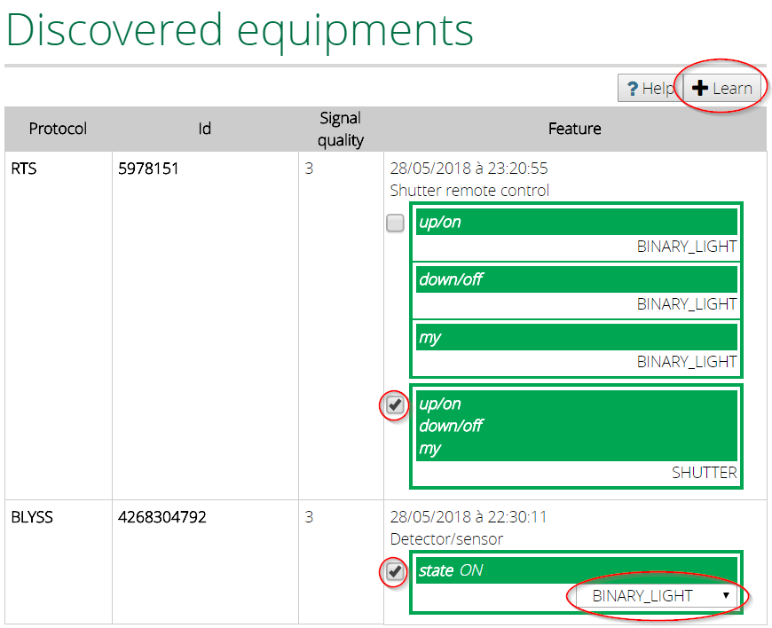
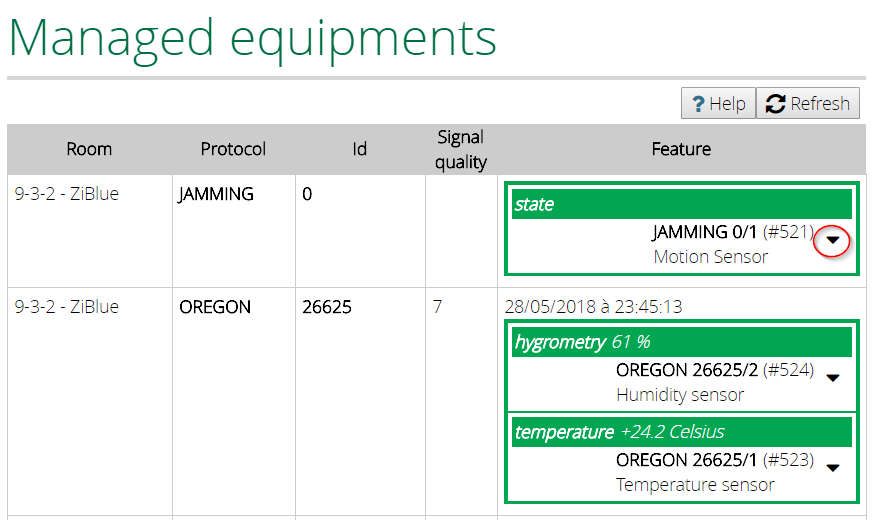
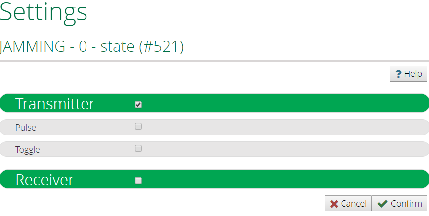

**This plugin is no longer maintained**


#  Vera-Plugin-ZiBlueGateway
<br/>

 
<br/>
<br/>

Designed for [Vera Control, Ltd.](http://getvera.com) Home Controllers (UI7) and [openLuup](https://github.com/akbooer/openLuup).

## Introduction

This plugin is a gateway to the ZiBlue RFP1000, and brings compatibility with lots of 433 & 868Mhz protocols.
<br/>
<br/>
<br/>
<br/>
<br/>

Please note these concepts first :
- **HAS**: Home Automation System (Vera or openLuup)
   - **UI**: User Interface
   - **Device**: a device managed by the HAS (e.g. a Zwave motion detector).
- **Dongle**: the ZiBlue RFP1000.
   - **Equipment**: a device exposed by the dongle (e.g. a 433 MHz temperature probe).
   - **Transmitter**: emits data/orders to dongle/HAS (e.g. a remote).
   - **Receiver**: reacts to transmitter orders, if pairing has been done (e.g. an outlet).
   - **Virtual transmitter**: simulates a transmitter and allows the HAS to control a receiver.

The plugin creates new devices (switches, dimmers, sensors, ...) in your HAS, corresponding to your equipments.
These devices appear in the UI as the others (e.g. Z-wave devices) and can be used in scenes.

For specific manipulations (settings, association), the plugin has its own UI.


## Requirements
 
Plug the dongle into an USB port of the HAS.


## Installation on Vera

#### Get the plugin

- Mios Marketplace

  This plugin is not available on the [Mios Marketplace](http://apps.mios.com/).

- Alternate App Store on ALTUI

- [Github repository](https://github.com/vosmont/Vera-Plugin-ZiBlueGateway)
  
  Upload the files in "luup files" in the Vera (by the standard UI in "Apps-->Develop Apps-->Luup files").
  
  Create a new device in "Apps-->Develop Apps-->Create device", and set "Upnp Device Filename" to "D_ZiBlueGateway1.xml".

#### Set the serial connection

Assign the serial port of the dongle to the plugin : go to "Apps/Develop Apps/Serial Port Configuration" and select from "Used by device" drop down list the "ZiBlue Gateway".
Set the following parameters :

```
Baud Rate : 115200
Data bits : 8
Parity    : none
Stop bits : 1
```

## Installation on openLuup

#### Get the plugin
- Alternate App Store on ALTUI

- Github repository

#### Set the serial connection

1. Retrieve the usb device

With the command "dmesg", you will find the mounted point.
```
[    7.151351] usbcore: registered new interface driver usbserial
[    7.151525] usbcore: registered new interface driver usbserial_generic
[    7.151663] usbserial: USB Serial support registered for generic
[    7.230878] usbcore: registered new interface driver pl2303
[    7.231047] usbserial: USB Serial support registered for pl2303
[    7.231167] pl2303 1-1.3:1.0: pl2303 converter detected
[    7.323296] usb 1-1.3: pl2303 converter now attached to ttyUSB0
```
In this example, the USB device is reachable on /dev/ttyUSB0

2. Install Serial to Network Proxy

Install ser2net
```
sudo apt-get update
sudo apt-get install ser2net
```

3. Configuration

Edit the file "ser2net.conf"
```
sudo nano /etc/ser2net.conf
```
Add this line (it depends on your device)
```
3481:raw:0:/dev/ttyUSB0:115200 8DATABITS NONE 1STOPBIT
```

4. Restart the deamon
```
sudo /etc/init.d/ser2net restart
```

5. Declare the serial connection

Set the attribut "ip" to "127.0.0.1:3481", on the plugin instance.


## Add your equipments

1. The "Discovered equipments" tab displays the equipments exposed by the dongle and not yet known from the HAS.


2. To be able to use the equipments on the HAS, you have to :
- select a modeling (definition of the relationships between equipment and devices, by features).
- the type of device can sometimes be chosen: this will not change the functionality but its representation in the UI.
- have the HAS learn this modeling.

For example, an equipment measuring temperature and humidity will be associated with 2 devices on the HAS : a temperature sensor and a humidity sensor.


## Known equipments

The equipments, exposed by the dongle and learned by the HAS, behave themselves as standard devices on the HAS.

You will find all the learned equipments in the "Managed equipments" tab.


## Equipment/Device settings

1. In the "Managed equipments" tab, click on the button "Action" of the device linked to the equipment.


2. You can change the behavior of your device (e.g., change the parameters "Pulse" or "Toggle" of a transmitter).

## Association

You can define a link between your device and another device in your HAS. It allows you to bind devices without having to use scenes.

From the tab "Managed equipments" in the plugin, click on the action "Associate" of the device you wish to link.
Then select the compatible devices and validate.

Association means that changes on the device will be passed on the associated device (e.g. if the device is switched on, the associated device is switched on too).


## Logs

You can control the plugin execution in the logs. Just set the variable "DebugMode" to 1.
Then in a ssh terminal :

- on Vera :
```
tail -f /var/log/cmh/LuaUPnP.log | grep "^01\|ZiBlueGateway"
```

- on openLuup :
```
tail -F {openLuup folder}/cmh-ludl/logs/LuaUPnP.log | grep -a "ERROR\|ZiBlueGateway"
```
